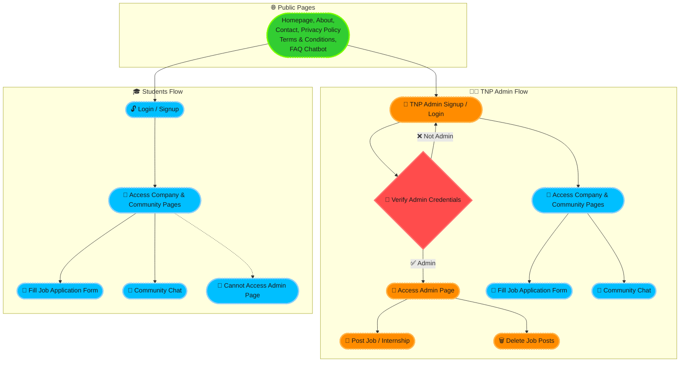

# BPIT Placement Website

## Description
This project is created for BPIT (Bhagwan Parshuram Institute of Technology) college placement students to streamline and manage placement activities. Currently, students rely on third-party platforms like POD for job-related updates and placement information. This platform aims to provide a more personalized and efficient way for students and companies to engage with the placement process.

The project is built using the MERN stack (MongoDB, Express, React, Node.js) to ensure scalability, flexibility, and a seamless user experience.

## 🚀 Project Workflow Diagram


## Features
- 🔒 **User Authentication & Authorization**: Secure login for students, admins, and companies.
- 👤 **Profiles**: Dedicated profiles for students and companies.
- 💼 **Job Listings & Applications**: Browse and apply for placement opportunities.
- 📊 **Admin Dashboard**: Manage job postings and placements with ease.
- 🔔 **Real-Time Notifications**: Stay updated with instant alerts.
- 📧 **Contact Form**: Integrated with EmailJS for seamless communication.
- 🎨 **Attractive UI**: Smooth animations using Lottie and Framer Motion.
- 📱 **Responsive Design**: Optimized for both mobile and desktop devices.

## 🧰 Tech Stack

<div align="center">

### 🖥️ Frontend


</div>

<div align="center">

### 🗃️ Backend


</div>

<h2>Project Structure</h2>
<pre><code>
bpit-careerhub/
├── backend/                   # Express.js backend
│   ├── index.js               # Entry point
│   ├── controller/            # Route logic (company, user, message)
│   ├── model/                 # Mongoose schemas
│   ├── routes/                # API endpoints
│   ├── middleware/            # Auth middleware
│   └── jwt/                   # JWT token utils
│
├── client/                    # React frontend
│   ├── public/                # Static assets
│   └── src/
│       ├── Component/         # Reusable components
│       │   ├── Charts/        # Placement stats charts
│       │   ├── Header/        # Header, footer, scroll handling
│       │   ├── MainComponent/ # Pages (Home, Company, Admin, etc.)
│       │   └── ProgressBar/   # Scroll progress UI
│       ├── App.js             # Main app component
│       ├── index.js           # React entry point
│       └── firebase.js        # Firebase config
│
├── README.md
└── .gitignore


</code></pre>


## Prerequisites
- Node.js and npm (Node Package Manager)
- MongoDB for database management
- React.js for frontend development

## Installation
To run this project locally, follow the steps below:

1. **Clone the repository**
    ```bash
    git clone <repository-url>
    cd bpit-placement
    ```

2. **Install server-side dependencies**
    Navigate to the backend folder and install the dependencies:
    ```bash
    cd backend
    npm install
    ```

3. **Install client-side dependencies**
    Navigate to the frontend folder and install the dependencies:
    ```bash
    cd frontend
    npm install
    ```

4. **Set up environment variables**
    Create a `.env` file in the backend directory with the following variables:
    ```ini
    MONGO_URI=<Your MongoDB URI>
    JWT_SECRET=<Your JWT Secret>
    EMAILJS_USER_ID=<Your EmailJS User ID>
    EMAILJS_TEMPLATE_ID=<Your EmailJS Template ID>
    EMAILJS_SERVICE_ID=<Your EmailJS Service ID>
    ```

5. **Run the application**
    - Start the backend server:
      ```bash
      cd backend
      npm start
      ```
    - Start the frontend application:
      ```bash
      cd frontend
      npm start
      ```
    Your application should now be running on [http://localhost:3000](http://localhost:3000).

## Deployment
The project is deployed on Render and can be accessed at:

[BPIT Placement Live Site](https://bpit-careerhub.onrender.com)


## Credits
This project was created to improve the placement process for BPIT students and reduce reliance on third-party platforms. The MERN stack was chosen for its scalability and efficiency in building modern web applications. Special thanks to the open-source community for providing the tools and libraries used in this project.

## License
This project is open-source and available under the MIT License. See the LICENSE file for details.

## Contributing
Feel free to fork this project and submit issues or pull requests if you want to contribute.

